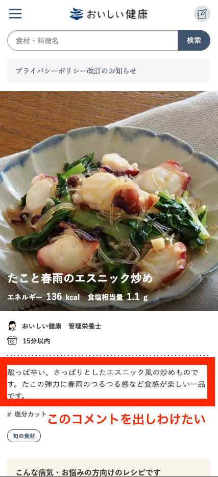
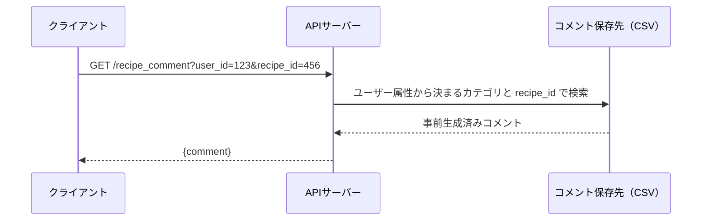

# レシピコメント生成機能 開発課題

おいしい健康の実際のプロダクトに近い題材で、機能開発に取り組んでいただく課題です。
このリポジトリには、課題のベースとなる**簡易サンプル実装**と**配布データ**が含まれています。

本課題では、以下のような点を拝見したいと考えています。

- 実務に近い設計・実装の進め方
- どのような設計判断をし、なぜそうしたのか

完成度の高さそのものよりも、**工夫した点や設計判断とその理由が読み取れること**を重視しています。迷った点や、あえて割り切った点があれば、ドキュメントやコード内のコメントに残してください。

実装にあたっては LLM（生成AI）によるコーディング支援の利用を前提としています。生成AIを活用しながらどのように開発を進めるかも含めて取り組んでいただいて構いません。

> まず下の「シナリオ」「課題の概要」を読んでイメージをつかみ、
> 実際に手を動かすときは末尾の **[セットアップと動かし方](#セットアップと動かし方)** に進んでください。

---

## シナリオ

レシピ詳細画面に、**そのユーザーに向けた「おすすめの一言コメント」を表示したい**という要望があります。同じレシピでも、ユーザーの属性（登録病態・料理スキル・BMI）によって響くポイントは異なるため、ユーザーに合わせてコメントを出し分けたい、というのが狙いです。

現在、この一言コメントはレシピごとに 1 つだけ用意されており（`recipes.csv` の `recipe_comment`）、**どのユーザーが見ても同じ内容**が表示されています。下の画面では、レシピ「たこと春雨のエスニック炒め」に対して、誰に対しても同じ説明文が出ている状態です。この部分を、画面を開いたユーザーに刺さる内容へと出し分けたい、というのが今回の狙いです。



## 課題の概要

`user_id` と `recipe_id` を受け取り、そのユーザーに合ったコメントを返す API を、Python・FastAPI で実装していただきます。コメント自体は LLM（OpenAI API）で生成します。

やることを一言でいうと、次の 3 つです。

1. **ユーザーをカテゴリに分類する**（属性 → カテゴリ）
2. **「カテゴリ × レシピ」ごとのコメントを LLM で事前生成し、CSV に保存する**
3. **API で `user_id` → カテゴリを求め、`(カテゴリ, recipe_id)` でコメントを引いて返す**

ゼロから作る必要はありません。上記を**ランダム分類・レシピ非考慮**で雑に実装したサンプルを用意してあるので、それを拡張する形で取り組んでください。

### コメントのイメージ

レシピ「鶏むね肉のさっぱり煮」に対して、属性の異なる2人のユーザーへのコメント例です。

- 「鶏むね肉でヘルシーに仕上がる一品です。工程もシンプルなので、平日の夜にも作りやすいですよ。」
- 「高たんぱく低脂質な鶏むね肉を使った、体づくりにもうれしい一品。お酢の効果でさっぱり食べられます。」

同じレシピでも、ユーザー属性に応じて訴求ポイントが変わるイメージです。

### 設計方針（あらかじめこちらで決めています）

リアルタイムで LLM を呼び出すとレスポンスタイムが許容できないため、コメントはあらかじめ生成して データベース（今回はCSV ファイル）に保存しておきます。

一方で、ユーザー × 全レシピの組み合わせでコメントを生成するとLLM推論コストが膨大になり、さらにユーザーがプロフィールを変更したり新規登録するたびに再生成が必要になってしまいます。

そこで、ユーザーを**いくつかのカテゴリに分類**し、**「カテゴリ × レシピ」** の組み合わせでコメントを事前生成します。リクエスト時は `user_id` から属性を引いてカテゴリを決定し、`(カテゴリ, recipe_id)` で CSV から引いて返します。

---

## 機能要件

### API リクエスト時の流れ



### 入出力

**リクエスト**

- メソッド：GET
- パス：/recipe_comment
- クエリパラメータ：`user_id`, `recipe_id`

```
GET /recipe_comment?user_id=1&recipe_id=1691
```

**レスポンス**

```json
{
  "comment": "鶏むね肉でヘルシーに仕上がる一品です。工程もシンプルなので、平日の夜にも作りやすいですよ。"
}
```

---

## 扱うデータ

本課題で扱うデータは `data/` ディレクトリに CSV 形式で用意しています（レシピ 50品 / ユーザー 100人）。各テーブルは `recipe_id` / `user_id` で紐づきます。カテゴリ分類は、このユーザーデータの属性をもとに設計してください。

### `users.csv` — ユーザーデータ（100人）

| 列名            | 説明             | 取りうる値の例                                                                                                                   |
| --------------- | ---------------- | -------------------------------------------------------------------------------------------------------------------------------- |
| `user_id`       | ユーザーID       | 1〜100                                                                                                                           |
| `height_cm`     | 身長（cm）       | 例：158.0                                                                                                                        |
| `weight_kg`     | 体重（kg）       | 例：55.8                                                                                                                         |
| `bmi`           | BMI 値           | 例：22.1                                                                                                                         |
| `cooking_skill` | 料理スキル       | `初心者` / `初級` / `中級` / `上級`                                                                                              |
| `concern_name`  | 登録病態・関心事 | `健康的な食生活・病気予防`、`ダイエット`、`糖尿病（2型）`、`高血圧`、`脂質異常症`、`妊娠中（後期）`、`貧血対策` など（全20種類） |

> 配布データに欠損はありませんが、課題では「属性が欠損しているユーザー」や「想定したカテゴリに当てはまらないユーザー」が来た場合の扱いも考慮してください。

### `recipes.csv` — レシピ（50品）

| 列名             | 説明                                                       |
| ---------------- | ---------------------------------------------------------- |
| `recipe_id`      | レシピID                                                   |
| `recipe_title`   | レシピ名                                                   |
| `recipe_comment` | 現在の一言コメント（全ユーザー共通。今回出し分けたい対象） |

### `ingredients.csv` — 材料

| 列名              | 説明                                 |
| ----------------- | ------------------------------------ |
| `ingredient_id`   | 材料ID                               |
| `recipe_id`       | 紐づくレシピID                       |
| `ingredient_name` | 材料名                               |
| `quantity_text`   | 表示用の分量（例：`1/4個分（40g）`） |
| `gram`            | グラム換算した分量                   |

### `cooking_steps.csv` — 調理手順

| 列名          | 説明                 |
| ------------- | -------------------- |
| `step_id`     | 手順ID               |
| `recipe_id`   | 紐づくレシピID       |
| `step_number` | 手順の番号（並び順） |
| `step_text`   | 手順の本文           |

### `recipe_tags.csv` — レシピのタグ

| 列名             | 説明                                                                            |
| ---------------- | ------------------------------------------------------------------------------- |
| `recipe_id`      | 紐づくレシピID                                                                  |
| `tag_name`       | タグ名（例：`塩分が少なめ`、`焼く`）                                            |
| `tag_group_name` | タグの分類（`栄養価` / `仕上げの調理方法` / `調理時間目安` / `必要な調理器具`） |

> どのデータを、どこまで LLM に渡すかはご自身で設計してください（これも評価の対象です）。
> 1 レシピ分の情報は `storage.get_recipe_detail(recipe_id)` でまとめて取得できます。

---

## 実装していただくこと

1. **ユーザー属性 → カテゴリ分類のロジック**（[`app/classifier.py`](app/classifier.py)）
   - サンプルはランダム分類です。属性（登録病態・料理スキル・BMI）に基づく分類に置き換えてください
   - カテゴリ数や分類ルールはご自身で設計してください
   - 属性が欠損しているユーザーや、想定したカテゴリに当てはまらないユーザーの扱いも考慮してください
2. **コメント事前生成スクリプト（バッチ処理）**（[`scripts/generate_comments.py`](scripts/generate_comments.py)）
   - `(カテゴリ, レシピ)` の全組み合わせに対して LLM でコメントを生成してください
   - 結果を CSV ファイルに保存してください
   - LLM に渡すレシピ情報の選定も、ご自身で考えてください
3. **API エンドポイント**（[`app/main.py`](app/main.py)）
   - `user_id` と `recipe_id` を受け取り、カテゴリへ変換し、CSV から該当コメントを引いて返す
   - 該当するコメントが存在しない組み合わせが来た場合の扱い（フォールバック）も考慮してください
4. **動作確認**（[`tests/test_api.py`](tests/test_api.py)）
   - 簡単なテストコード、または動作確認用スクリプトで構いません
5. **設計メモ**（[`docs/design_memo.md`](docs/design_memo.md)）
   - カテゴリをどう設計したか、LLM に渡すレシピ情報をどう選んだか、その判断の根拠を簡単にまとめてください
   - 形式は問いません。長文である必要はなく、考えたことが伝わればOKです

なお、**「どのようなカテゴリで分けるか」「カテゴリごとに狙い通りのコメントが出し分けられているか」は本課題の中心となる部分**です。一字一句の表現の完成度までは求めませんが、分類の設計とコメント内容の妥当性は取り組みの対象に含まれます。

### スコープ外

以下は取り組んでいただく必要はありません。

- コメント文面の磨き込み（言い回しの最終調整やトーンの細かな作り込み）
- 認証・認可
- フロントエンド
- 本番環境への組み込み

---

## リポジトリ構成

```
.
├── README.md                  # このファイル
├── requirements.txt           # 使用ライブラリとバージョン（固定）
├── .python-version            # 使用する Python バージョン（3.11）
├── .env.example               # API キー設定のテンプレート（.env はコピーして作る）
├── app/                       # API サーバー
│   ├── main.py                #   FastAPI エンドポイント（GET /recipe_comment）
│   ├── classifier.py          #   ユーザー分類（ランダム分類のサンプル）
│   ├── llm.py                 #   OpenAI 呼び出しの窓口（messages→テキスト）
│   ├── storage.py             #   CSV 読み書きユーティリティ
│   └── config.py              #   設定（パス・モデル名など）
├── scripts/
│   └── generate_comments.py   # プロンプト＋コメント事前生成（サンプル）
├── tests/
│   └── test_api.py            # 簡単な動作確認テスト
├── data/                      # 配布データ（CSV。読み取り専用のイメージ）
│   ├── users.csv              #   ユーザー 100 人（属性付き）
│   ├── recipes.csv            #   レシピ 50 品（現在の一言コメント付き）
│   ├── ingredients.csv        #   材料
│   ├── cooking_steps.csv      #   調理手順
│   └── recipe_tags.csv        #   レシピのタグ
├── output/                    # 生成物の出力先（配布データとは分離）
│   └── comments.csv           #   事前生成したコメント（生成すると作られる）
└── docs/
    └── design_memo.md         # 設計メモ（記入して提出）
```

---

## サンプル実装の構成

サンプルは「ランダム分類・レシピ非考慮」で、要件を雑に満たしただけの状態です。
主に手を入れるのは次の 3 ファイルです。

| 主に編集 | ファイル                                                       | 役割                                                                                                          |
| -------- | -------------------------------------------------------------- | ------------------------------------------------------------------------------------------------------------- |
| ◎        | [`app/classifier.py`](app/classifier.py)                       | カテゴリ分類。`classify_user`（割り当て）/ `list_categories`（全カテゴリ列挙）/ `describe_category`（説明文） |
| ◎        | [`scripts/generate_comments.py`](scripts/generate_comments.py) | プロンプト（冒頭の文字列）＋生成ループ（レシピ × カテゴリ）                                                   |
| ◎        | [`app/main.py`](app/main.py)                                   | API の返し方。`(カテゴリ, recipe_id)` での引き方・フォールバック                                              |

そのほかの主要なファイル：

- [`app/llm.py`](app/llm.py) — OpenAI 呼び出しの窓口。`llm.generate(messages)` に messages を渡すとテキストが返ります
- [`app/storage.py`](app/storage.py) — CSV の読み書き。`get_recipe_detail(recipe_id)` で 1 レシピ分の情報（材料・手順・タグ）をまとめて取得できます
- [`app/config.py`](app/config.py) — パスやモデル名などの設定

カテゴリの「キー」は文字列です。BMI・スキル・病態をそれぞれ分類して組み合わせた
ものをキーにする、といった設計も、`classify_user` がその文字列を返し、
`list_categories` がその一覧を返すようにするだけで実現できます。

> **プロンプトを試行錯誤するときのコツ**：[`scripts/generate_comments.py`](scripts/generate_comments.py)
> 冒頭のプロンプト文を書き換えて `python -m scripts.generate_comments`
> （または `--dry-run` で API を使わず構造だけ確認）を回す、というループが回しやすいです。
> 少数のカテゴリ・レシピで試してから全件生成すると、API コストを抑えられます。

---

## セットアップと動かし方

最低限の手順をまとめています。

### 1. Python のインストール

Python 3.11 以上を使用します（このリポジトリは 3.11 で動作確認しています）。

```bash
# macOS / Linux
python3 --version

# Windows (PowerShell)
py --version
```

インストールされていない場合は次のように導入してください。

- **macOS**：[python.org](https://www.python.org/downloads/) の公式インストーラ、または Homebrew（`brew install python@3.11`）
- **Windows**：[python.org](https://www.python.org/downloads/) の公式インストーラ。インストール時に **「Add python.exe to PATH」にチェック**を入れてください

> このあとの説明では、コマンドを **macOS / Linux** と **Windows (PowerShell)** に分けて記載します。お使いの OS の行を実行してください。

### 2. リポジトリをクローンする

```bash
git clone <お渡しするリポジトリのURL>
cd recipe-comment-coding-task
```

### 3. 仮想環境を作成してライブラリをインストールする

プロジェクトごとにライブラリを分離するため、仮想環境（venv）を使います。

**macOS / Linux**

```bash
python3 -m venv .venv
source .venv/bin/activate
pip install -r requirements.txt
```

**Windows (PowerShell)**

```powershell
py -m venv .venv
.venv\Scripts\Activate.ps1
pip install -r requirements.txt
```

> - 有効化に成功すると、プロンプトの先頭に `(.venv)` が付きます。以降のコマンドはこの状態で実行してください。
> - 有効化したあとは、OS を問わず `python` / `pip` コマンドが使えます。

### 4. OpenAI API キーを設定する

API キーは**別途共有します**。共有されたキーを `.env` に設定してください。

```bash
# macOS / Linux
cp .env.example .env

# Windows (PowerShell)
copy .env.example .env
```

作成した `.env` をエディタで開き、`OPENAI_API_KEY=` の右側に共有されたキーを貼り付けます。

```
OPENAI_API_KEY=sk-xxxxxxxxxxxxxxxxxxxxxxxx
```

> `.env` は `.gitignore` で除外されており、Git にはコミットされません。
> **API キーは絶対にコードや CSV に直接書いたり、コミットしたりしないでください。**

### 5. サンプルを動かす

コマンド自体は OS 共通です（venv を有効化した状態で実行してください）。

```bash
# (1) コメントを事前生成する → output/comments.csv が作られる
python -m scripts.generate_comments --dry-run   # まず API を使わずダミーで確認
python -m scripts.generate_comments             # OpenAI API で実際に生成（.env が必要）

# (2) API サーバーを起動する
uvicorn app.main:app --reload

# (3) 別ターミナルから動作確認
curl "http://127.0.0.1:8000/recipe_comment?user_id=1&recipe_id=1691"
# -> {"comment": "..."}

# (4) テストを実行する
pytest
```

動作確認（3）は、ブラウザで [http://127.0.0.1:8000/docs](http://127.0.0.1:8000/docs) を開いて画面から試すのが簡単です（FastAPI の自動ドキュメント）。

> Windows の PowerShell では `curl` が別コマンドの別名になっているため、上記の `curl` がそのまま動かないことがあります。その場合はブラウザの `/docs` を使うか、`curl.exe "http://..."` のように `.exe` を付けて実行してください。

> **コメントは必ず (1) を先に実行してから (2) を起動してください。**
> サーバーは `output/comments.csv` を**起動時に一度だけ**読み込みます。
> CSV が無い状態で起動したり、起動後に再生成した場合は、コメントが読み込まれず
> フォールバック文（`このレシピをぜひお楽しみください。`）が返ります。
> 再生成したときは**サーバーを再起動**してください。
> 読み込めているかは `curl http://127.0.0.1:8000/health` の `comments` の件数で確認できます（0 なら未読み込み）。

---

## 提出方法

`main` ブランチで直接作業せず、作業用のブランチを作成してください。
ブランチ名には**ご自身の名前**を入れてください（例：`submission/yamada-taro`）。

```bash
git switch -c submission/yamada-taro       # yamada-taro はご自身の名前に置き換えてください
```

ファイルを編集したら、こまめにコミットしてください（コミットの粒度や履歴も拝見します）。

```bash
git add .
git commit -m "ユーザー属性に基づく分類ロジックを実装"
```

作業ブランチを GitHub に push し、`main` ブランチに向けた **Pull Request** を作成してください。これが提出となります。

```bash
git push -u origin submission/yamada-taro   # 作成したブランチ名に置き換えてください
```

push 後、GitHub のリポジトリページに表示される **「Compare & pull request」** から PR を作成します。設計メモは [`docs/`](docs/) ディレクトリに含めてください。

### 期限・質問について

- **期限**：課題ご案内日から原則 1 週間以内（ご都合があれば別途ご相談ください）
- **ご質問**：課題に関するご質問は受け付けます。採用担当までお寄せください

ご不明な点がありましたら、お問い合わせください。よろしくお願いいたします。
